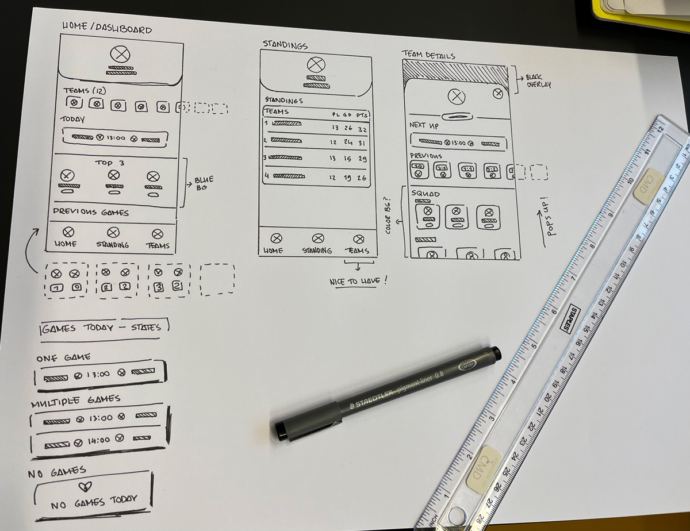
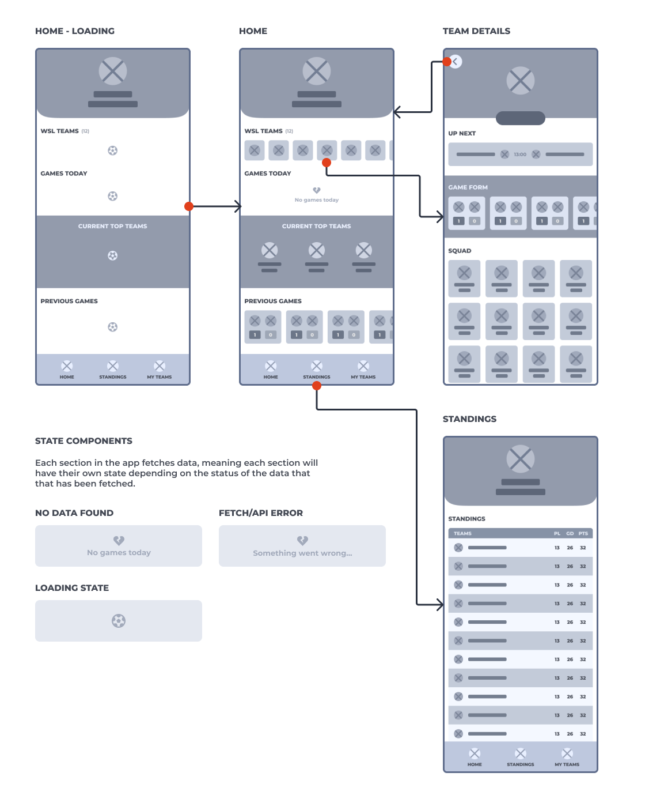
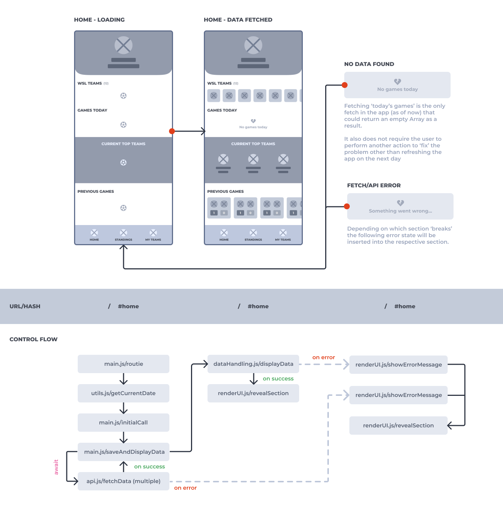
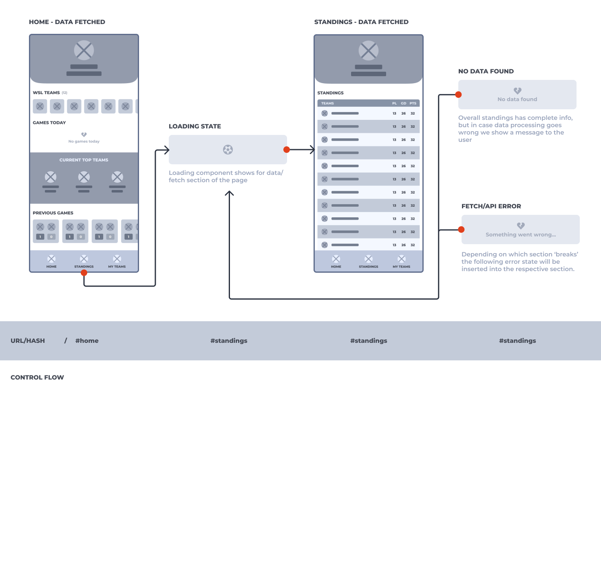
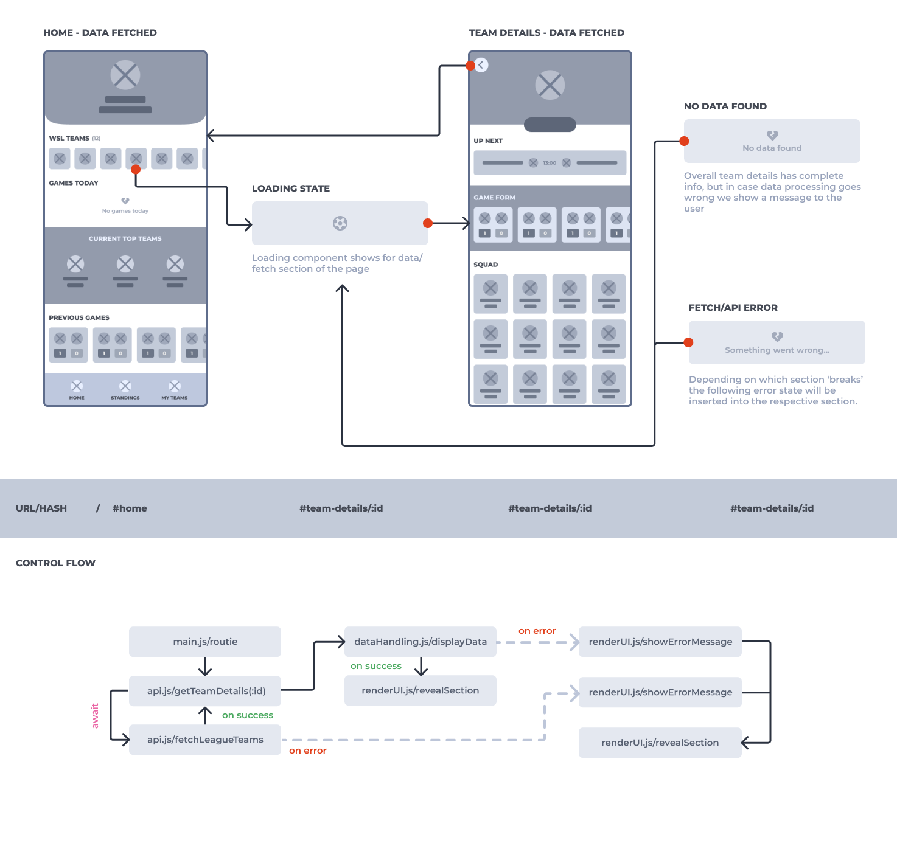

# :notebook_with_decorative_cover: WSLH - Product documentation

For the course "Web App From Scratch" everyone was tasked to design and build a Single Page web App (SPA) based on a user story. The teachers gave us about three weeks for this assignment. The catch is that we had to retrieve data from an external API, manipulate and display said data, but only by using vanilla HTML, CSS and Javascript.

## :page_facing_up: User Story

As you might already be aware, I developed a football application to keep you up-to-date with your favorite teams in the FA Women's Super League. I have enjoyed football for as long as I can remember, I was practically raised in a Galatasaray household where we watched games with the family every weekend. To no one's surprised, I ended up playing football myself as well, however I never actually joined a team. I played on the streets with my friends and occasionaly went to a local club to use their pitches.

Back then, women's football was not really a thing, or at least where I lived it was not common for young girls to play football. I never questioned why women's football was not a thing, children were raised with the idea that football is a boys sport only. And I feel like, to this day, quite a lot of people still have this exact same mentality when it comes to football, or just sports in general. Only recently did I get a glimpse of women's football: Women's Football World Cup of 2019. The Netherlands reached the semi-finals and was up against the United States. I personally feel like after that specific World Cup people started paying attention and became more aware of women's footbal. 

This year I wanted to *really* get into women's football. I quickly learned how inaccessible women's football is. Talking about the inaccessibility of women's football is a topic on it's own. But I wanted to create something to help others, and myself, keep up-to-date with their favorite teams. Yes, plenty of football apps exists, but none of them focus on women's football! So, for this assignment I came up with a women's football related user story to build my app around:

> "As a Women's Super League enjoyer, I want to be able to quickly view the latest standings of the league, get to know all the teams and see when their next games will be played, so that I can stay up-to-date on the league and the teams"

As you can read in the user story I decided to focus on the FA Women's Super League (WSL), which is the female equivalant of the English Premier League. The WSL is one of the more popular women's football leagues out there. Women's football is popular in the United states, however due to timezone differrences my desire to keep up with their leagues is non existent. The WSL and Liga F are currently the only leagues (for me) that are most accessible. I personally find Liga F to not interest me as much as the WSL; FC Barcelona pretty much dominates Liga F, meaning they win all games and are always #1 on the standings. The WSL appears to be more diverse when it comes to teams (performance wise, at least to me), and overall their games get broadcasted, which is why I chose to focus on WSL for now.

## :globe_with_meridians: Choosing an API

Before I picked this user story I browsed the web for free REST APIs with live football data. Not a lot of options for us football and coding enjoyers out there... Most of the APIs were amazing, don't get me wrong, but the issue was that they would either require you to sign up for a payment plan in order to receive a key, or they would only allow a certain amount of API calls per month.  

After scrolling through Google for a while I ended up finding a rather charming API, made by developers who enjoy sports: [TheSportsDB](https://thesportsdb.com/)! As their site describes, TheSportsDB website is a collection of metadata, artwork, results and tables that has a JSON API. The site was built in 2015 to serve a need for a common interface of sports data for various Home Theatre Applications. Since then it has grown into one of the largest free sports databases on the net.

It offers several free API endpoints, so I experimented with those first and found they suited my needs. As I kept on developing, I wanted more features, so I ended up subscribing to their Patreon for €5,50 in order to receive a key (cheap and worth it! especially in comparison to other APIs).

## :art: Initial interface design

Once I knew creating this app with TheSportsDB would be possible, I had to figure out what the app was going to look like visually. I drew up a few sketches; I knew the core of the app was displaying relevant data to the user, so I first and foremost needed a landing page, standings overview and team details. In the sketches and wireflows below you can see how I added 'Teams' or 'My teams' to the bottom navigation, this is because I want to eventually add a feature which allows users to save their favorite teams. But for now, this is marked as a 'nice-to-have' feature.



After finishing these sketches I created a wireflow, to serve as a visual representation of how users would be interacting with the app and how the app would respond to certain interactions



Since the assignment was to create a Single Page web App, I quickly came to the conclusion that every page would be a `<article>`, since each page could be a standalone 'article' so to speak. And this would also help me to create a clear structure in HTML. Within each article I figured the best thing to do would be to create sections of data. Meaning I could give each section of data their very own states, like: loading or empty/no data states. By doing so, I could also incorporate the error messages into those sections the same way.

## :zap: Activity Diagram

Before I created the WSLH activity diagram, I had been programming for several days. Most of the functionalities work (besides setting favorite teams) and all my JS functions had been split up into modules.

```js
"../scripts/main.js" // starting point
"../scripts/api.js" // fetching data
"../scripts/dataHandling.js" // manipulating data and appending in HTML
"../scripts/renderUI.js" // displaying/hiding data
"../scripts/storage.js" // everything related to local storage
"../scripts/utils.js" // 'other' functions such as getCurrentDate()
```

An activity diagram shows the flow of activities that occur within a system or application. It is kind of like a flowchart that shows all the steps that need to be taken (within the code) in order to complete a task.

### Activity Diagram - Home



As seen in the image above, the very first state users will see is the loading state. This state is the very first state by default. Only when a section has retrieved data will it change into something else, which of course depends on what the status is of the fetched data will be: empty or fetch/api error.

In the control flow it shows that each activity starts in `main.js/routie`. Routie controls what needs to be done on each page. Because we are on the 'Home' page, the first thing the app does is check if the user needs new 'fresh' data or not. It does so by comparing the current date with the last updated date set in local storage.

The result of this check gets passed onto `main.js/saveAndDisplayData`. It performs one or multiple fetches, and waits for the data. After receiving the data successfully it gets saved into local storage and passed onto `dataHandling.js/displayData` and then `renderUI.js/revealSection`. 

If an error were to accur in `api.js/fetchData` or if the data was empty, both call `renderUI.js/showErrorMessage` which inserts an error message into HTML. Afterwars `renderUI/revealSection` gets called to display the message.

### Activity Diagram - League standings



The activity diagram for viewing league standings is pretty much the same as viewing the home page, except instead of potentially performing multiple API, it only has to fetch the current standings, meaning it's a singular API call.

### Activity Diagram - Team details



The activity diagram for viewing team details is slightly different. Like the other pages, it starts with `main.js/routie`. Data from team details is the only thing that does not get saved in local storage. Therefore we know this page always needs fresh data, so it goes straight to `api.js/getTeamDetails(:id)`. 

Within this function, it fetches all the WSL league teams in order to be able to dislay 'next up' and 'previous' games. This data then gets passed along to the `displayData` function. Everything afterwards is the same as the other activity diagrams.

## :stars: Future ambitions

I guess you could say I have gotten quite attached to this little project over the past few weeks. I enjoyed every second of coding and designing. I personally see potential in creating an actual app like this that only focuses on women's football.

What I've created now is good, but I feel like it could be much better. Better UI design and better data manipulation/handling (especially since everything is done in vanilla JS). I would like to explore this project more design wise, but also want to make an actual PWA with Node.JS and perhaps add a MySQL database.

I also hope to add more features to the WSLH such as selecting your favorite teams and getting a different home/dashboard based on your selection. This way the app could actually be a personal hub.